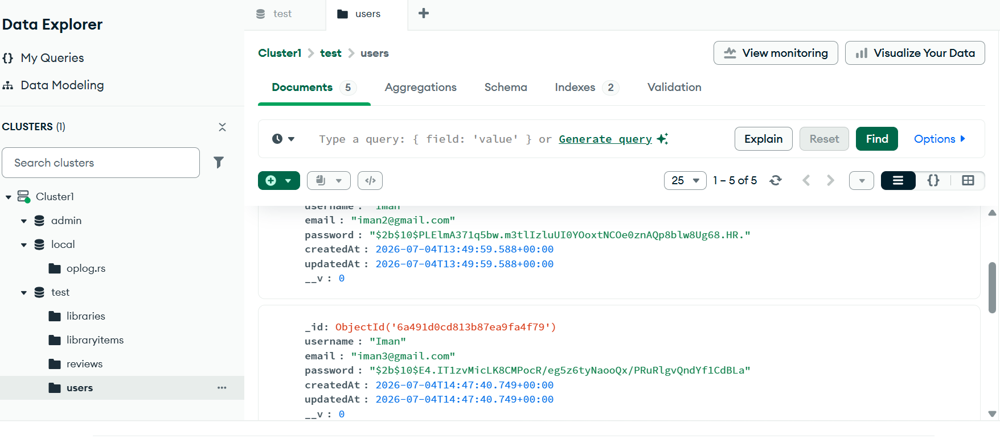
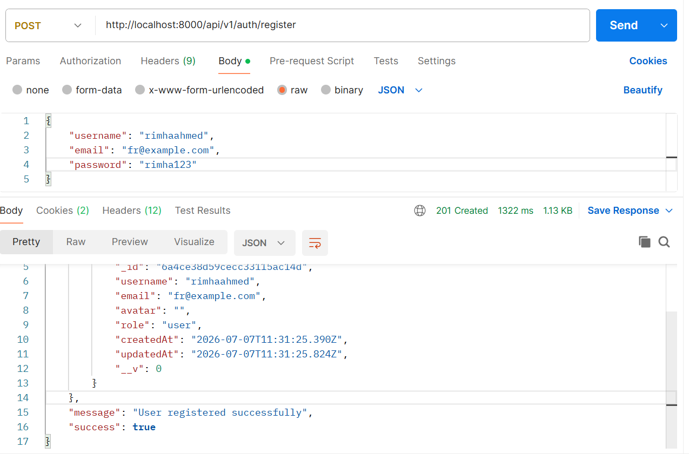

#  Authentication Backend API

A secure backend built with **Node.js, Express.js, MongoDB, and JWT Authentication**. This project implements user authentication, database integration, and RESTful APIs, and has been thoroughly tested using Postman.

---

## 🚀 Features

-  User Authentication with JWT
-  Access Token & Refresh Token
-  MongoDB Database Integration
-  Mongoose Models
-  Password Hashing with Bcrypt
-  RESTful API Endpoints
-  Express.js Server
-  API Testing with Postman
-  Environment Variables for Secure Configuration

---

## 🛠️ Tech Stack

- Node.js
- Express.js
- MongoDB Atlas
- Mongoose
- JWT (JSON Web Token)
- Bcrypt.js
- Postman
- dotenv

---

## 📸 Screenshots

### MongoDB Atlas Connection

> Successfully connected to MongoDB Atlas.

---

### Postman API Testing

> API endpoints tested successfully using Postman.

---

## 🤖 AI Recommendation

This project integrates the **Google Gemini AI API** to provide intelligent and personalized recommendations based on user input. The AI feature enhances the application's functionality by generating dynamic responses and recommendations through natural language processing.

**AI Features:**

- Google Gemini AI API Integration
- AI-powered recommendations
- Dynamic response generation
- REST API integration with Gemini
- Secure API key management using environment variables

---

## 📖 What I Learned

- Creating REST APIs with Express.js
- Connecting Node.js with MongoDB Atlas
- Designing Mongoose Models
- Implementing JWT Authentication
- Managing Access & Refresh Tokens
- Securing passwords using Bcrypt
- Testing APIs with Postman
- Using environment variables for configuration

